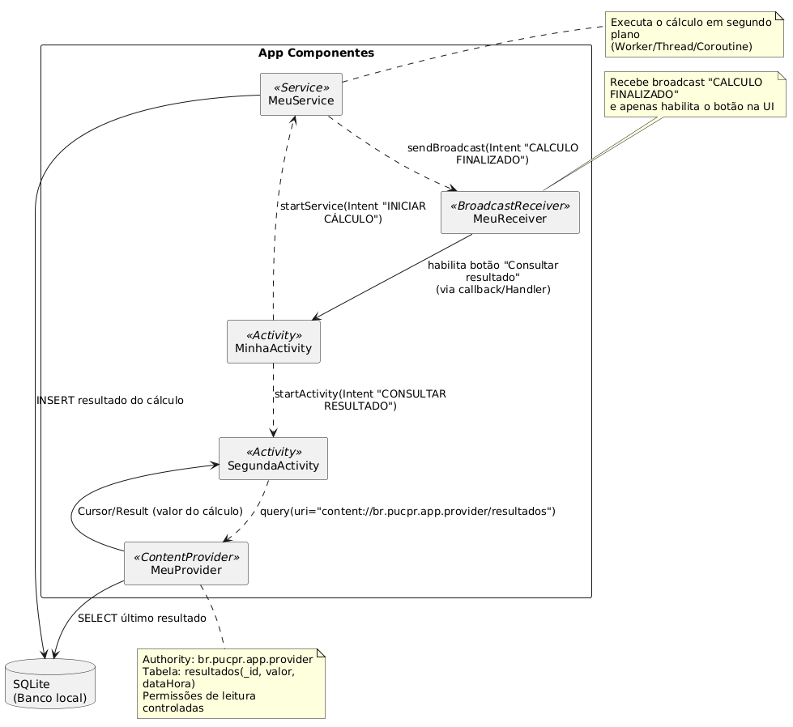
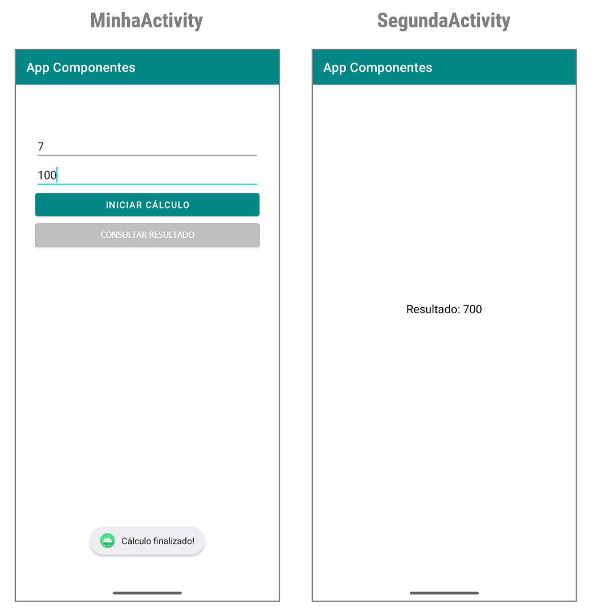
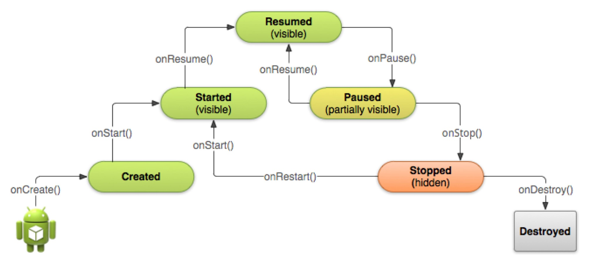
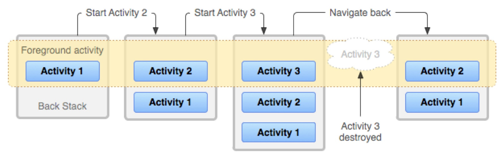

# Aplicativo Android (Legado): componentes arquiteturais.

Este projeto apresenta a **versão construída em sala de aula** de um aplicativo Android (Legado) voltado para alunos iniciantes e demonstra como usar os quatro componentes principais da arquitetura Android:

- `Activity`
- `Service`
- `BroadcastReceiver`
- `ContentProvider`

O exemplo simula a multiplicação de dois números utilizando somas sucessivas feitas 
em segundo plano, usando um service, armazena o resultado no banco de dados e o exibe o resultado através de um content provider na segunda tela.

## Conteúdo apresentados

- Ciclo de vida dos componentes Android
- Comunicação entre componentes com Intent
- Execução em segundo plano com Service
- Registro e recepção de Broadcast
- Persistência de dados com SQLite
- Uso de ContentProvider para leitura controlada de dados
- Interações simples com a UI (Toast, Log, TextView, Button)

---

## Fluxo do aplicativo

1. O usuário digita dois valores na MinhaActivity e clica em **Iniciar cálculo**.
2. A multiplicação é feita em segundo plano pelo `MeuService`.
3. O resultado é salvo no banco de dados SQLite.
4. O service dispara um broadcast CALCULO FINALIZADO.
5. O `BroadcastReceiver` MeuReceiver registrado no app recebe a notificação de que o cálculo terminou e ativa o botão **Consultar resultado**.
6. Quando o usuário chama a `SegundaActivity` ela acessa o resultado via `ContentProvider` MeuProvider e o exibe o resultado na tela.

### 

## Requisitos para execução

- Android Studio (versão recente)
- Emulador ou dispositivo Android físico

## Principais componentes

- `MinhaActivity`: tela principal com botão que aciona o serviço.
- `MeuService`: serviço responsável por simular um cálculo pesado.
- `MeuReceiver`: recebe a notificação de término do serviço.
- `MeuProvider`: provê acesso ao banco de dados (SQLite).
- `SegundaActivity`: tela que exibe o resultado salvo.

### Layout das telas:
### 

## Estrutura de arquivos

```text
br.pucpr.app/
├── MinhaActivity.java
├── MeuService.java
├── MeuReceiver.java
├── MeuProvider.java
├── SegundaActivity.java
└── BancoHelper.java (é apresentado mais adiante)
```
---

## Tela principal

Responsável pela interface principal e ponto de partida da aplicação.

### Layout da tela principal:
### 

### `activity_minha.xml`

Este layout define a interface principal da `MinhaActivity`, sendo um exemplo 
de como construir uma tela simples e funcional no Android com foco em interação do usuário.

## Recursos utilizados

- **LinearLayout (vertical)**: organiza os elementos de forma empilhada verticalmente.
- **EditText**:
    - `edtPrimeiro` e `edtSegundo` para entrada de dois valores numéricos decimais.
    - Possuem `textAlignment="center"` para melhorar a usabilidade visual.
    - `hint` fornece dicas do que o usuário deve inserir.
- **Button**:
    - `btnIniciar`: inicia o cálculo ao ser pressionado.
    - `btnConsultar`: fica inicialmente desabilitado (`enabled="false"`) e só é ativado 
    - após o fim do processamento realizado pelo `Service`.

## Observações

- O uso de `android:layout_marginTop="150dp"` posiciona os elementos abaixo do topo, criando um espaçamento confortável para visualização.
- `android:padding="30dp"` assegura um bom espaçamento interno, evitando que os elementos fiquem colados às bordas da tela.
- O layout é adequado para atividades pedagógicas e demonstra boas práticas básicas de design responsivo com componentes nativos.

```xml
<?xml version="1.0" encoding="utf-8"?>
<LinearLayout xmlns:android="http://schemas.android.com/apk/res/android"
    android:orientation="vertical" android:layout_width="match_parent"
    android:layout_height="match_parent"
    android:layout_marginTop="150dp"
    android:padding="30dp">

    <EditText
        android:id="@+id/edtPrimeiro"
        android:layout_width="match_parent"
        android:layout_height="wrap_content"
        android:textAlignment="center"
        android:hint="Informe o primeiro valor"
        android:text="1.7"
        android:inputType="numberDecimal" />

    <EditText
        android:id="@+id/edtSegundo"
        android:textAlignment="center"
        android:layout_width="match_parent"
        android:layout_height="wrap_content"
        android:hint="Informe o segundo valor"
        android:text="100"
        android:inputType="numberDecimal" />

    <Button
        android:id="@+id/btnIniciar"
        android:layout_width="match_parent"
        android:layout_height="wrap_content"
        android:text="Iniciar Cálculo" />

    <Button
        android:id="@+id/btnConsultar"
        android:layout_width="match_parent"
        android:layout_height="wrap_content"
        android:text="Consultar Resultado"
        android:enabled="false" />
</LinearLayout>
```

## Segunda tela

Responsável por apresentar o resultado do cálculo.

### Layout da segunda tela:
### 

### `activity_segunda.xml`

Este layout define a interface gráfica da segunda tela da aplicação, responsável por exibir o resultado do cálculo realizado em segundo plano. Utiliza um `LinearLayout` vertical com um `TextView` centralizado, com formatação ajustada para garantir boa legibilidade. A interface é minimalista, voltada exclusivamente à apresentação do dado persistido no banco de dados. O `TextView` é identificado por um ID, permitindo que a lógica da `SegundaActivity` preencha o campo dinamicamente com o conteúdo recuperado do `ContentProvider`.

> **Nota:** Este layout reflete o princípio de separação de responsabilidades na arquitetura Android, 
ao manter a interface desacoplada da lógica de negócio, permitindo fácil reutilização e manutenção.


```xml
<?xml version="1.0" encoding="utf-8"?>
<LinearLayout
    xmlns:android="http://schemas.android.com/apk/res/android"
    android:layout_width="match_parent"
    android:layout_height="match_parent"
    android:orientation="vertical"
    android:padding="24dp"
    android:gravity="center">

    <TextView
        android:id="@+id/txtResultado"
        android:layout_width="wrap_content"
        android:layout_height="wrap_content"
        android:text="Resultado aparecerá aqui"
        android:textSize="18sp"
        android:textColor="#000000"
        android:padding="16dp" />

</LinearLayout>
```


### `MinhaActivity.java`

Esta classe representa a `Activity` principal de um aplicativo Android, demonstrando o uso 
didático de diversos componentes fundamentais da plataforma.

## Recursos utilizados

- **EditText e Button**: para entrada de dados e ações do usuário.
- **Intent explícita**: utilizada para iniciar o `Service` e navegar entre `Activities`.
- **Service**: executa cálculos em segundo plano, sem bloquear a interface.
- **BroadcastReceiver (dinâmico)**: escuta no término da tarefa de segundo plano para habilitar a próxima ação.
- **Controle de ciclo de vida**: `registerReceiver` no `onStart()` e `unregisterReceiver` no `onStop()`.
- **Toast**: feedback rápido e visual para o usuário.
- **Log.d**: mensagens de depuração para acompanhar o fluxo da aplicação.

### Ciclo de vida de uma activity:
### 

## Fluxo resumido

1. O usuário insere dois números e clica em **Iniciar**.
2. Um `Service` realiza um cálculo com os dados.
3. Ao finalizar, o `Service` envia um `Broadcast`.
4. O `BroadcastReceiver` escuta esse evento e habilita o botão **Consultar**.
5. O botão **Consultar** permite navegar para a `SegundaActivity` com o resultado.

## MinhaActivity.java – (1ª versão)

```java
public class MinhaActivity extends AppCompatActivity {

    @Override
    protected void onCreate(Bundle savedInstanceState) {
        super.onCreate(savedInstanceState);
        setContentView(R.layout.activity_minha);

        Button btnIniciar = findViewById(R.id.btnIniciar);
        Button btnConsultar = findViewById(R.id.btnConsultar);

        btnIniciar.setOnClickListener(v -> {
            Toast.makeText(MinhaActivity.this, "Calcular!", Toast.LENGTH_SHORT).show();
        });

        btnConsultar.setOnClickListener(v -> {
            Intent intent = new Intent(this, SegundaActivity.class);
            startActivity(intent);
        });
    }
}
```
## Empilhamento de activities
### 


## MinhaActivity.java – (2ª versão) incluir intent
```java
public class MinhaActivity extends AppCompatActivity {

    @Override
    protected void onCreate(Bundle savedInstanceState) {
        super.onCreate(savedInstanceState);
        setContentView(R.layout.activity_minha);

        Button btnIniciar = findViewById(R.id.btnIniciar);
        Button btnConsultar = findViewById(R.id.btnConsultar);

        EditText edtPrimeiro = findViewById(R.id.edtPrimeiro);
        EditText edtSegundo = findViewById(R.id.edtSegundo);

        btnIniciar.setOnClickListener(v -> {
            double primeiro = Double.parseDouble(edtPrimeiro.getText().toString());
            double segundo = Double.parseDouble(edtSegundo.getText().toString());
            Intent intent = new Intent(this, MeuService.class);
            intent.putExtra("primeiro", primeiro);
            intent.putExtra("segundo", segundo);
            startService(intent);
        });

        btnConsultar.setOnClickListener(v -> {
            Intent intent = new Intent(this, SegundaActivity.class);
            startActivity(intent);
        });
    }
}
```

## MeuService.java – (1ª versão) execução em segundo plano

A classe `MeuService` é um `Service` Android que realiza o cálculo de uma multiplicação 
(simulada por somas repetidas) em segundo plano, sem bloquear a interface do usuário. 
Após o cálculo, ele envia um `broadcast` para informar o fim da operação e grava o resultado no banco SQLite.

### Responsabilidades principais

- **Cálculo em background**:
    - O método `onStartCommand()` recupera dois valores da `Intent`, inicia uma `Thread` e simula um tempo de execução com `Thread.sleep(2000)`.
    - O cálculo é feito com base em somas sucessivas: soma `primeiro` a ele mesmo `segundo` vezes.

- **Persistência de dados**:
    - O resultado final é gravado na tabela `resultados` por meio da função auxiliar `gravarResultadoNoBanco()`.

- **Notificação via broadcast**:
    - Um `Intent` com a ação `"CALCULO_FINALIZADO"` é enviado com `sendBroadcast(...)`, permitindo que a `Activity` ou o `BroadcastReceiver` saiba que o cálculo foi concluído.

- **Controle de ciclo de vida**:
    - O retorno `START_NOT_STICKY` garante que o serviço não será recriado automaticamente se for encerrado pelo sistema.

### Detalhes técnicos importantes

- **Execução assíncrona**:
  A execução ocorre em uma `Thread`, evitando bloqueios na interface do usuário.

- **Encerramento do serviço**:
  Após concluir seu trabalho, o método `stopSelf()` encerra o serviço explicitamente.

- **Gravação em banco SQLite**:
  Utiliza a classe `BancoHelper` para inserir o resultado no banco de dados local.

### Observações

- Este `Service` é iniciado com `startService(intent)` e não está preparado para uso com `bindService`.
- Ideal para operações curtas e pontuais que exigem execução em background com feedback simples via `BroadcastReceiver`.

```java
public class MeuService extends Service {

    @Override
    public int onStartCommand(Intent intent, int flags, int startId) {

        // Mensagem de depuração para verificar se o service foi iniciado
        Log.d("AppComponentes", "Chamou o service!");

        // Recupera os valores passados pela Intent
        double primeiro = intent.getDoubleExtra("primeiro", 0.0);
        double segundo  = intent.getDoubleExtra("segundo", 0.0);

        // Exibe os valores no Logcat
        Log.d("AppComponentes", "Valor A: " + primeiro);
        Log.d("AppComponentes", "Valor B: " + segundo);

        // Garante que o service não será recriado automaticamente
        return START_NOT_STICKY; 
    }
}
```

## MeuService.java – (2ª versão) realizar cálculo

```java
public class MeuService extends Service {
    @Override
    public int onStartCommand(Intent intent, int flags, int startId) {

        // Recupera os valores enviados pela Activity
        double primeiro = intent.getDoubleExtra("primeiro", 0.0);
        double segundo = intent.getDoubleExtra("segundo", 0.0);

        // Executa o cálculo como soma repetida
        double resultado = 0;
        for (int i = 0; i < segundo; i++) {
            resultado += primeiro;
        }

        // Envia uma Intent broadcast avisando que o cálculo terminou
        Intent broadcastIntent = new Intent("CALCULO_FINALIZADO");
        sendBroadcast(broadcastIntent);

        // Encerra o serviço após a execução
        stopSelf();

        // Indica que o serviço não será recriado automaticamente
        return START_NOT_STICKY;
    }
}

```

## MeuService.java – (3ª versão) processar em outra thread

```java
public class MeuService extends Service {
    @Override
    public int onStartCommand(Intent intent, int flags, int startId) {

        double primeiro = intent.getDoubleExtra("primeiro", 0.0);
        double segundo = intent.getDoubleExtra("segundo", 0.0);

        new Thread(() -> {
            try {
                // Simula um delay de 2 segundos
                Thread.sleep(2000);

                // Calcula a multiplicação como somas repetidas
                double resultado = 0;
                for (int i = 0; i < segundo; i++) {
                    resultado += primeiro;
                }

                // Envia um broadcast indicando que o cálculo terminou
                Intent broadcastIntent = new Intent("CALCULO_FINALIZADO");
                sendBroadcast(broadcastIntent);

                // Finaliza o serviço explicitamente
                stopSelf();

            } catch (InterruptedException e) {
                throw new RuntimeException(e);
            }
        }).start();

        // Garante que o serviço não será recriado se for encerrado pelo sistema
        return START_NOT_STICKY;
    }
}
```

## BancoHelper.java – criar banco SQLite

A classe `BancoHelper` é responsável por criar e gerenciar o banco de dados SQLite da aplicação. 
Ela estende `SQLiteOpenHelper`, que oferece uma estrutura pronta para controle de versões e criação do banco.

### Recursos utilizados

- **Extensão de SQLiteOpenHelper**:
  Permite definir lógica de criação e atualização do banco de dados SQLite local.

- **Constantes**:
    - `NOME_DB`: define o nome físico do banco (`meu.db`).
    - `VERSAO_DB`: controla a versão do banco para detecção de mudanças.

- **Construtor com Context**:
  O `context` permite que o helper seja utilizado por Activities, Services ou ContentProviders.

- **onCreate(SQLiteDatabase db)**:
    - Cria a tabela `resultados` com os campos:
        - `_id`: chave primária autoincrementável.
        - `resultado`: valor inteiro calculado.
    - Executa um SQL puro para criar a tabela.

- **onUpgrade(SQLiteDatabase db, int oldVersion, int newVersion)**:
    - Remove a tabela antiga (se existir) e chama `onCreate()` novamente.
    - Estratégia simples usada em protótipos ou apps didáticos onde não é necessário manter os dados entre versões.

### Observações

Este helper é adequado para aplicações simples. Em ambientes de produção, seria necessário criar uma política de migração de dados ao invés de eliminar as tabelas.

```java
public class BancoHelper extends SQLiteOpenHelper {

    // Nome do banco de dados
    private static final String NOME_DB = "meu.db";

    // Versão do banco de dados
    private static final int VERSAO_DB = 1;

    /**
     * Construtor padrão que inicializa a classe com o contexto da aplicação.
     * @param context O contexto da aplicação ou activity que está criando o banco.
     */
    public BancoHelper(Context context) {
        super(context, NOME_DB, null, VERSAO_DB);
    }

    /**
     * Método chamado automaticamente ao criar o banco de dados pela primeira vez.
     * Aqui definimos a estrutura da tabela "resultados", contendo:
     * - _id: chave primária autoincrementável
     * - resultado: valor inteiro calculado
     * @param db Instância do banco de dados SQLite sendo criado.
     */
    @Override
    public void onCreate(SQLiteDatabase db) {
        db.execSQL("CREATE TABLE resultados (_id INTEGER PRIMARY KEY AUTOINCREMENT, resultado INTEGER)");
    }

    /**
     * Método chamado quando há mudança na versão do banco de dados.
     * Nesse caso, a tabela é descartada e recriada. Estratégia simples, mas que apaga os dados.
     * @param db         Instância do banco de dados.
     * @param oldVersion Versão anterior do banco.
     * @param newVersion Nova versão solicitada.
     */
    @Override
    public void onUpgrade(SQLiteDatabase db, int oldVersion, int newVersion) {
        db.execSQL("DROP TABLE IF EXISTS resultados");
        onCreate(db); // Recria a estrutura após descartar a antiga
    }
}
```

## MeuService.java – (4ª versão) gravar resultado no banco de dados

```java
public class MeuService extends Service {

    /**
     * Método chamado quando o serviço é iniciado.
     * Os parâmetros "primeiro" e "segundo" são recebidos via intent e usados para o cálculo.
     * Após a conclusão, é enviado um broadcast e o serviço é finalizado.
     * @param intent  intent que inicia o serviço, contendo os dados para o cálculo
     * @param flags   flags de controle (não usados neste exemplo)
     * @param startId identificador da instância do serviço
     * @return        START_NOT_STICKY indica que o serviço não será recriado automaticamente
     */
    @Override
    public int onStartCommand(Intent intent, int flags, int startId) {

        // Recupera os parâmetros da intent
        double primeiro = intent.getDoubleExtra("primeiro", 0.0);
        double segundo = intent.getDoubleExtra("segundo", 0.0);

        // Executa o processamento em uma nova thread para não travar a UI
        new Thread(() -> {
            try {
                // Simula um delay de 2 segundos
                Thread.sleep(2000);

                // Simula um cálculo de multiplicação (soma repetida)
                double resultado = 0;
                for (int i = 0; i < segundo; i++) {
                    resultado += primeiro;
                }

                // Grava o resultado no banco de dados SQLite
                gravarResultadoNoBanco((int) resultado);

                // Envia um broadcast indicando que o cálculo foi finalizado
                Intent broadcastIntent = new Intent("CALCULO_FINALIZADO");
                sendBroadcast(broadcastIntent);

                // Registra no log
                Log.d("AppVazio", "Resultado: " + resultado);

                // Finaliza o serviço explicitamente
                stopSelf();

            } catch (InterruptedException e) {
                throw new RuntimeException(e);
            }
        }).start();

        // Indica que o serviço não deve ser recriado automaticamente se for finalizado pelo sistema
        return START_NOT_STICKY;
    }

    /**
     * Método obrigatório para serviços, usado apenas em serviços ligados (bind).
     * Como não usamos bind neste exemplo, retorna null.
     */
    @Override
    public IBinder onBind(Intent intent) {
        return null;
    }

    /**
     * Grava o resultado do cálculo na tabela "resultados" do banco de dados local.
     * @param resultado valor numérico a ser salvo
     */
    private void gravarResultadoNoBanco(int resultado) {
        BancoHelper helper = new BancoHelper(this);
        SQLiteDatabase db = helper.getWritableDatabase();
        ContentValues values = new ContentValues();
        values.put("resultado", resultado);
        db.insert("resultados", null, values);
        db.close();
    }
}
```

## MinhaActivity.java – (3ª versão) incluir registerReceiver - onStart() e onStop()

```java
public class MinhaActivity extends AppCompatActivity {

    // Declaração dos botões que serão utilizados na interface
    private Button btnIniciar, btnConsultar;

    @Override
    protected void onCreate(Bundle savedInstanceState) {
        super.onCreate(savedInstanceState);

        // Define qual layout XML será usado nesta Activity
        setContentView(R.layout.activity_minha);

        // Referencia os botões definidos no layout XML
        btnIniciar = findViewById(R.id.btnIniciar);
        btnConsultar = findViewById(R.id.btnConsultar);

        // O botão de consulta só é habilitado após o término do cálculo (via BroadcastReceiver)
        btnConsultar.setEnabled(false);

        // Referência para os campos de entrada numérica
        EditText edtPrimeiro = findViewById(R.id.edtPrimeiro);
        EditText edtSegundo = findViewById(R.id.edtSegundo);

        // Define a ação ao clicar no botão "Iniciar"
        btnIniciar.setOnClickListener(v -> {
            // Converte os textos dos EditTexts em números double
            double primeiro = Double.parseDouble(edtPrimeiro.getText().toString());
            double segundo = Double.parseDouble(edtSegundo.getText().toString());

            // Cria uma Intent para iniciar o serviço em segundo plano
            Intent intent = new Intent(this, MeuService.class);
            intent.putExtra("primeiro", primeiro);
            intent.putExtra("segundo", segundo);

            // Inicia o serviço para realizar o cálculo
            startService(intent);
        });

        // Define a ação ao clicar no botão "Consultar"
        btnConsultar.setOnClickListener(v -> {
            // Cria uma Intent para abrir a SegundaActivity
            Intent intent = new Intent(this, SegundaActivity.class);
            startActivity(intent); // Inicia a nova Activity
        });
    }

    // Referência para o receiver que escutará quando o cálculo for finalizado
    private BroadcastReceiver meuReceiver;

    @Override
    protected void onStart() {
        super.onStart();

        // Instancia o receiver e o registra para escutar o evento de "CALCULO_FINALIZADO"
        meuReceiver = new MeuReceiver(btnConsultar);
        registerReceiver(meuReceiver, new IntentFilter("CALCULO_FINALIZADO"), Context.RECEIVER_EXPORTED);
    }

    @Override
    protected void onStop() {
        super.onStop();

        // Remove o receiver para evitar vazamento de memória quando a Activity não estiver visível
        unregisterReceiver(meuReceiver);
    }
}
```

## MeuReceiver.java – escuta para ativar botão

A classe `MeuReceiver` é um `BroadcastReceiver` responsável por reagir à finalização do 
serviço em segundo plano. Sua principal função é reabilitar a interface da aplicação e 
notificar o usuário quando o cálculo for concluído.

### Responsabilidades principais

- **Escuta de intents específicas**:
    - Registra e escuta `Intents` com a ação `"CALCULO_FINALIZADO"` enviadas pelo `MeuService`.

- **Atualização da interface**:
    - Reabilita o botão de consulta (`btnConsultar`) para permitir novas interações.
    - Utiliza o padrão de injeção via construtor para receber a referência ao botão da `Activity`.

- **Notificação ao usuário**:
    - Exibe um `Toast` com a mensagem "Cálculo finalizado!" para informar o término da operação.

### Detalhes técnicos importantes

- **Vínculo à UI da Activity**:
    - Embora o `BroadcastReceiver` não tenha interface própria, ele manipula elementos da `MainActivity` via referência direta (o botão), mantendo o fluxo de controle da interface.

- **Log de depuração**:
    - O uso de `Log.d` permite o rastreamento de eventos no log do Android Studio com a tag `"AppVazio"`.

- **Segurança e boas práticas**:
    - A referência ao botão é marcada como `final`, garantindo imutabilidade dentro do receiver.

### Observações

- A instância de `MeuReceiver` deve ser registrada dinamicamente na `Activity`, utilizando `registerReceiver(...)` com um `IntentFilter` apropriado.

```java
public class MeuReceiver extends BroadcastReceiver {

    // Referência ao botão que será reabilitado ao receber a intent
    private final Button btnConsultar;

    /**
     * Construtor que recebe uma referência ao botão que será controlado pelo Receiver.
     * Este botão geralmente está na Activity principal e é desabilitado durante o processamento.
     *
     * @param btnConsultar botão que será reabilitado quando o cálculo terminar
     */
    public MeuReceiver(Button btnConsultar) {
        this.btnConsultar = btnConsultar;
    }

    /**
     * Método executado automaticamente quando a intent registrada é recebida.
     * Exibe uma notificação para o usuário e reabilita o botão.
     *
     * @param context o contexto da aplicação no momento da recepção
     * @param intent a intent recebida, que deve sinalizar o fim do processamento
     */
    @Override
    public void onReceive(Context context, Intent intent) {
        Log.d("AppVazio", "Intent recebida: " + intent.getAction());

        // Exibe uma mensagem ao usuário
        Toast.makeText(context, "Cálculo finalizado!", Toast.LENGTH_SHORT).show();

        // Reabilita o botão para permitir nova consulta
        btnConsultar.setEnabled(true);
    }
}
```

### minSdkVersion no build.gradle.kts

```java
    android {
       ...
        defaultConfig {
          ...
            minSdk = 26  // alterado de 24 para 26. Necessário para registerReceiver(...)
          ...
        }
    }
```

## MeuProvider.java - – criar provedor de dados

A classe `MeuProvider` implementa um **ContentProvider** de leitura, permitindo o acesso externo 
aos resultados persistidos no banco de dados SQLite da aplicação. É um dos quatro componentes 
centrais do Android, utilizado para compartilhar dados entre aplicações ou entre partes desacopladas 
de uma mesma aplicação.

### Responsabilidades principais

- **Exposição dos dados via URI pública**:
    - A URI `content://br.pucpr.app.provider/resultados` permite que outras partes da aplicação, ou mesmo outros apps com permissão, consultem os dados da tabela `resultados`.

- **Integração com o SQLite**:
    - Abre o banco de dados em modo somente leitura utilizando o `BancoHelper`, garantindo segurança e integridade no acesso.

- **Implementação mínima de ContentProvider**:
    - Apenas o método `query(...)` está implementado, pois o provider é **read-only** (não suporta inserção, exclusão ou atualização).

### Detalhes técnicos importantes

- **Constantes de configuração**:
    - `AUTHORITY` define a autoridade do provider, usada para registro no `AndroidManifest.xml`.
    - `CONTENT_URI` é o endpoint público exposto.

- **Banco de dados e projeções**:
    - A consulta delega ao método `query()` do `SQLiteDatabase`, que aceita projeções, filtros e ordenações.

- **Boas práticas**:
    - Métodos `insert`, `delete` e `update` retornam valores neutros (`null` ou `0`) e estão explicitamente não implementados para reforçar o comportamento somente leitura.

### Observações

- O ContentProvider permite que a **Activity**, por exemplo, utilize um `CursorLoader` ou `ContentResolver` para ler os resultados sem acoplamento direto à base SQLite.
- É necessário registrar o provider no `AndroidManifest.xml` com o mesmo `authority` especificado na classe.

```java
public class MeuProvider extends ContentProvider {

    // Autoridade do provider, deve estar registrada no AndroidManifest.xml
    private static final String AUTHORITY = "br.pucpr.app.provider";

    // Nome da tabela a ser acessada
    private static final String TABLE = "resultados";

    // URI de acesso público à tabela, usada por outras partes da aplicação
    public static final Uri CONTENT_URI = Uri.parse("content://" + AUTHORITY + "/" + TABLE);

    // Referência ao banco de dados SQLite
    private SQLiteDatabase db;

    /**
     * Método chamado quando o ContentProvider é iniciado pela primeira vez.
     * Abre conexão com o banco de dados para leitura (modo readonly).
     * @return true se o banco foi inicializado com sucesso.
     */
    @Override
    public boolean onCreate() {
        BancoHelper helper = new BancoHelper(getContext());
        db = helper.getReadableDatabase(); // Abre banco somente leitura
        return true;
    }

    /**
     * Método principal de consulta de dados do ContentProvider.
     * Utiliza o método query do SQLiteDatabase para retornar os registros solicitados.
     *
     * @param uri URI solicitada (deve bater com CONTENT_URI)
     * @param projection Colunas desejadas (null = todas)
     * @param selection Cláusula WHERE
     * @param selectionArgs Argumentos para o WHERE
     * @param sortOrder Ordenação (ex: "_id DESC")
     * @return Cursor com os dados encontrados
     */
    @Override
    public Cursor query(Uri uri, String[] projection, String selection, String[] selectionArgs, String sortOrder) {
        return db.query(TABLE, projection, selection, selectionArgs, null, null, sortOrder);
    }

    // Métodos abaixo não são implementados, pois o provider é somente leitura.
    @Override
    public String getType(Uri uri) {
        return null; // Não implementado porque não há tipos MIME específicos definidos
    }

    @Override
    public Uri insert(Uri uri, ContentValues values) {
        return null; // Operação de inserção não suportada
    }

    @Override
    public int delete(Uri uri, String selection, String[] selectionArgs) {
        return 0; // Operação de exclusão não suportada
    }

    @Override
    public int update(Uri uri, ContentValues values, String selection, String[] selectionArgs) {
        return 0; // Operação de atualização não suportada
    }
}
```

### `SegundaActivity.java`

Esta classe representa a segunda tela da aplicação, cuja responsabilidade é consultar 
o `ContentProvider` e exibir o último resultado salvo no banco de dados. 
No método `onCreate`, a `Activity` realiza a operação de leitura por 
meio do método `getContentResolver().query(...)`, solicitando apenas a última linha da 
tabela (ordenada por ID decrescente e limitada a um resultado). O valor recuperado 
é exibido dinamicamente no `TextView` da interface.

> **Nota:** Esta abordagem demonstra o uso de `ContentProvider` como mecanismo de compartilhamento 
estruturado de dados internos, respeitando o ciclo de vida da `Activity`, 
boas práticas de acesso a dados e encapsulamento da persistência. 
O uso da cláusula `"_id DESC LIMIT 1"` permite buscar eficientemente o dado mais recente, 
sem necessidade de lógica adicional no código.

```java
public class SegundaActivity extends AppCompatActivity {

    /**
     * Método chamado ao criar a activity. Configura a interface gráfica e
     * realiza a consulta ao ContentProvider para exibir o último resultado salvo.
     * @param savedInstanceState estado salvo anteriormente, se houver (não usado aqui)
     */
    @Override
    protected void onCreate(Bundle savedInstanceState) {
        super.onCreate(savedInstanceState);
        setContentView(R.layout.activity_segunda);

        // Referência para o TextView onde será exibido o resultado
        TextView txtResultado = findViewById(R.id.txtResultado);

        // Consulta ao ContentProvider, solicitando a última linha da tabela "resultados"
        Cursor cursor = getContentResolver().query(
                MeuProvider.CONTENT_URI,               // URI do ContentProvider
                new String[]{"resultado"},             // Colunas desejadas
                null, null,                            // Sem cláusulas WHERE ou parâmetros
                "_id DESC LIMIT 1");                   // Ordena por ID decrescente, pegando o último resultado

        // Se encontrou algum resultado
        if (cursor != null && cursor.moveToFirst()) {
            int resultado = cursor.getInt(0); // Recupera o valor da primeira (e única) coluna
            txtResultado.setText("Resultado: " + resultado); // Exibe no TextView
            cursor.close(); // Fecha o cursor para liberar recursos
        }
    }
}
```

---
## Como executar o projeto

1. Clone este repositório.
2. Importe no Android Studio.
3. Execute o app em um emulador ou dispositivo físico.
4. Na tela principal, clique no botão "Calcular". 
5. Ao final do cálculo (simulado com delay), o botão será reabilitado.
6. Clique em “Consultar” para abrir a `SegundaActivity` e ver o resultado persistido.

## Observações

- O projeto utiliza banco de dados SQLite via `ContentProvider`.
- As permissões e registros estão definidos no `AndroidManifest.xml`.

---

**Professor:** Geucimar Briatore  
**Disciplina:** Desenvolvimento Android  
**Instituição:** PUCPR
